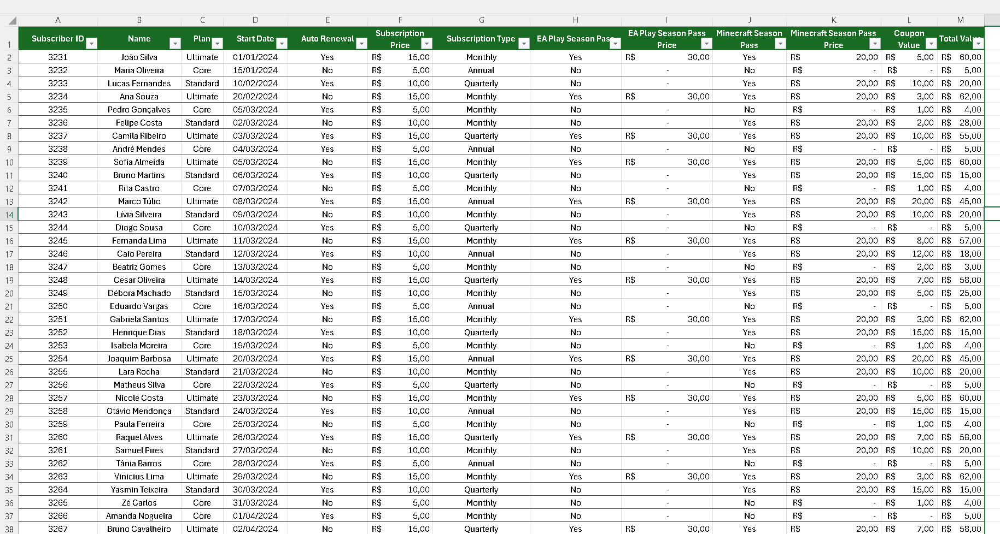
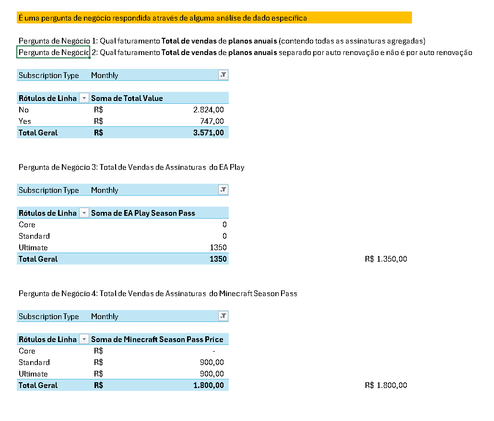
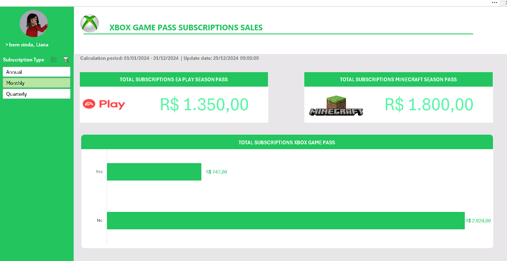

# 📊 Dashboard de Vendas no Excel

## 📌 Sobre o Projeto
Este projeto foi desenvolvido como parte de um desafio de **análise de dados e visualização em Excel**.  
O objetivo principal é transformar uma base de dados bruta em um **dashboard interativo e visualmente claro**, permitindo uma análise eficaz do desempenho de vendas e auxiliando na tomada de decisões estratégicas.

---

## 🗂️ Estrutura dos Dados
O arquivo `base.xlsx` contém três abas principais:

1. **Dados Brutos**  
   - Traz o registro de todas as assinaturas de clientes, incluindo:
     - ID do Assinante  
     - Nome  
     - Tipo de Plano (Core, Standard, Ultimate)  
     - Data de Início  
     - Preço da Assinatura  
     - Informações de Renovação Automática  
     - Passes adicionais (EA Play, Minecraft)  
     - Valores de Cupons e Totais  

     
   *Exemplo da planilha com os dados brutos de assinaturas*

2. **Cálculos / Perguntas de Negócio**  
   - Consolidações realizadas com tabelas dinâmicas para responder perguntas como:
     - Qual o faturamento total de vendas de planos anuais?  
     - Qual o faturamento separado por auto-renovação?  
     - Total de vendas do **EA Play**  
     - Total de vendas do **Minecraft Season Pass**  

     
   *Tabelas dinâmicas e cálculos intermediários para responder perguntas de negócio*

3. **Dashboard**  
   - Painel visual consolidado com:
     - KPIs de faturamento  
     - Gráficos comparativos  
     - Segmentação por tipo de assinatura  
     - Indicadores de passes adicionais  

     
   *Painel interativo desenvolvido no Excel para análise de vendas*

---

## 📊 Recursos Utilizados no Dashboard
- **Tabelas Dinâmicas** para organização e agregação de dados  
- **Gráficos Dinâmicos** para visualização  
- **Segmentações de Dados (Slicers)** para interatividade  
- **KPIs (Indicadores de Desempenho)** como faturamento total, comparativo de planos e adesão a passes adicionais  

---

## 🚀 Como Reproduzir
1. Baixe o arquivo [`base.xlsx`](./base.xlsx).  
2. Abra no **Microsoft Excel (2016 ou superior)**.  
3. Explore as abas:
   - **Dados Brutos** → visão detalhada de cada assinatura  
   - **Cálculos** → tabelas dinâmicas para responder perguntas de negócio  
   - **Dashboard** → painel consolidado e interativo  
4. Utilize os filtros para explorar cenários (ex.: tipo de assinatura, renovação automática, plano de passe adicional).  

> Caso queira recriar do zero, utilize a aba **Dados Brutos** como fonte para suas próprias análises.

---

## 🏆 Conclusão
Este projeto demonstra como dados brutos podem ser organizados e visualizados de forma eficiente dentro do Excel.  
O uso de **tabelas dinâmicas, gráficos e segmentações** permite responder perguntas de negócio relevantes e construir um dashboard que gera **insights estratégicos** para decisões baseadas em dados.

